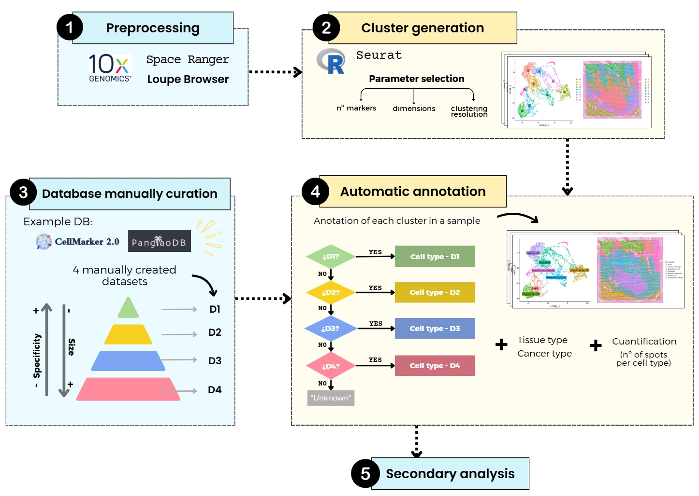

# TBLAB_STOmics

## Introduction
TBLAB_STOmics is a bioinformatics R script for the analysis, visualization and annotation of spatial transcriptomics data using Seurat. It allows its visualization, clustering and annotation of clusters to cell types using a mannually curated dataset.

This script focuses on the development of steps 2 and 4. With the results obtained, a secondary analysis can be performed.

#### Annotation strategy
The annotations are perfomed in hierarchical order,, with datasets ordered in accumulative order with decreasing specificity: D1 (most specific) > D2 > D3 > D4 (most general). Only unannotated clusters at each stage are passed to the next dataset.

## Pipeline summary
The script performs the following major steps:
1. Data loading: load 10X Genomics spatial stranscriptomics data.
2. Preprocessing: normalize, scale, PCA, UMAP, clustering.
3. Clustering: identify clusters.
4. Marker discovery: detect differentially expressed genes per cluster.
5. Annotation: assign cell types using reference datasets with decreasing specificity (D1 - D4).
6. Visualization: UMAP, spatial plots with and without annotation.
7. Output: save results including CSV files and plots.

## Get started
### Prerequisites
Have R installed, along with the following packages:
- library(Seurat)
- library(SeuratData)
- library(ggplot2)
- library(patchwork)
- library(dplyr)
- library(presto)
- library(devtools)

### Required Data
- 10x spatial transcriptomics data
- Annotation reference CSVs (from a database of cell markers): D1.csv, D2.csv, D3.csv, D4.csv; each containing at least:
  - symbol (gene symbol)
  - cell_name (cell type)
  - Additional metadata (optional but recommended for extended annotation):
    - tissue_type, cancer_type and tissue_class

## Usage
Rscript seurat_clusters.R <sample_name> <data_dir> <n.markers> <max.dimensions> <clustering.resolution>

### Example:
Rscript seurat_clusters.R sample /path/to/outs 10 10 0.5

## Script arguments:
- sample --> name of the sample (used for file output naming)
- data_dir --> path to folder containing "filtered_feature_bc_matrix.h5"
- n.markers --> number of top markers to consider per cluster
- max.dimensions --> number of PCA dimensions to use for UMAP and clustering
- clustering.resolutions --> clustering resolution for FindClusters() in Seurat

## Output includes:
- UMAP and spatial plots unannotated
- UMAP and spatial plots annotated
- Top markers per cluster
- Basic cell type annotation
- Cell type + tissue + cancer annotations
- Spot count and cell type per cluster

## Citation
If you use this pipeline, please cite:
- [Seurat - Satija Lab](https://satijalab.org/seurat/)
- 10X Genomics spatial transcriptomics
- Any references associated with your D1-D4 datasets.

## Author:
Lucía García Delgado
TBLab
 

    
